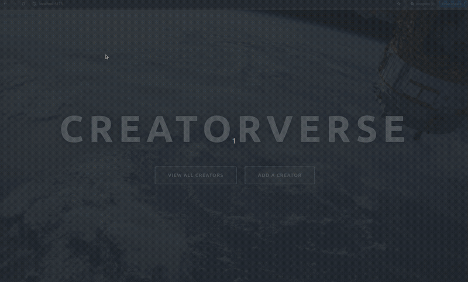

# Creatorverse

Submitted by: **Dhruv Mojila**

**Creatorverse** is a web app that lets you manage your favorite content creators. Browse a curated list of top YouTubers, TikTokers, and streamers — add new ones, edit their info, or remove them. Built with React + Supabase.

Time spent: **~4 hours**

## Required Features

The following **required** features are implemented:

- [x] **Use a logical component structure** in React to create the frontend of the app
- [x] **Display at least five content creators** on the homepage of the app
- [x] Each content creator item includes their **name**, a **link to their channel or page**, and a **short description**
- [x] **API calls use the async/await** design pattern via the Supabase JS client (built on fetch)
- [x] **Clicking on a content creator** takes the user to their details page, which includes their name, URL, and description
- [x] **Each content creator has their own unique URL**
- [x] The user can **edit** a content creator to change their name, URL, or description
- [x] The user can **delete** a content creator
- [x] The user can **add** a new content creator by entering a name, URL, and description
  - [x] The new content creator then **appears in the displayed list**

## Stretch Features

The following **stretch** features are implemented:

- [x] Use **PicoCSS** to style HTML elements (loaded via CDN)
- [x] Display content creator items in a creative format — **full-image cards** with gradient overlay
- [x] Show an **image** of each content creator on their creator card

## Video Walkthrough

## Notes

- Supabase table has no auto-increment `id` column — the app uses the creator's `name` (URL-encoded) as the unique route identifier
- Node 18 compatibility required using Vite v4 and react-router-dom v6

## License

    Copyright 2026 Dhruv Mojila

    Licensed under the Apache License, Version 2.0 (the "License");
    you may not use this file except in compliance with the License.
    You may obtain a copy of the License at

        http://www.apache.org/licenses/LICENSE-2.0

    Unless required by applicable law or agreed to in writing, software
    distributed under the License is distributed on an "AS IS" BASIS,
    WITHOUT WARRANTIES OR CONDITIONS OF ANY KIND, either express or implied.
    See the License for the specific language governing permissions and
    limitations under the License.
